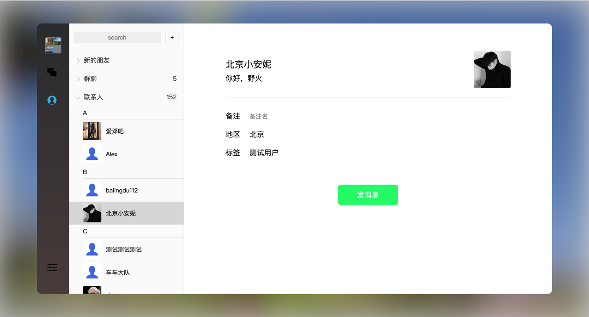
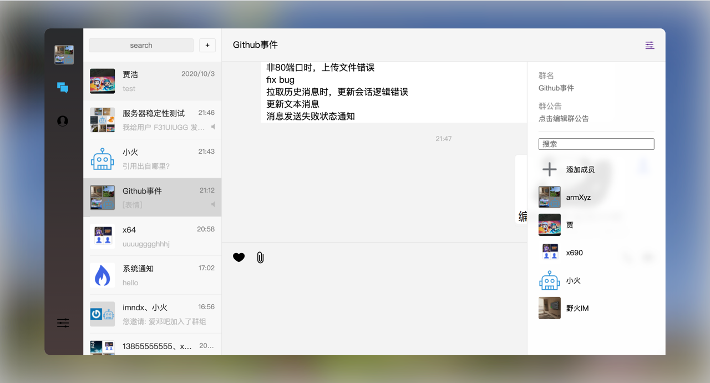
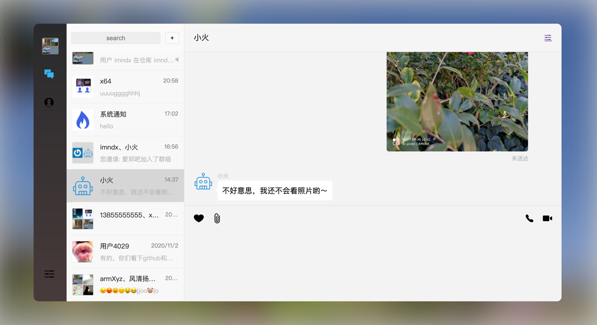
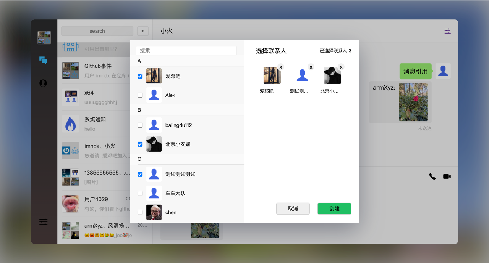
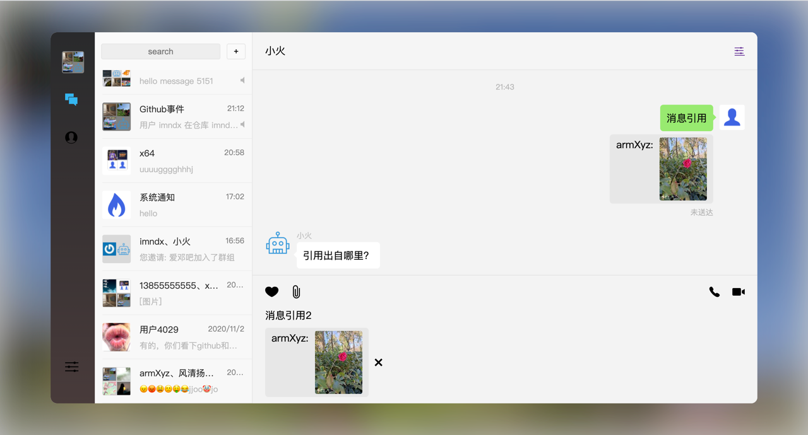
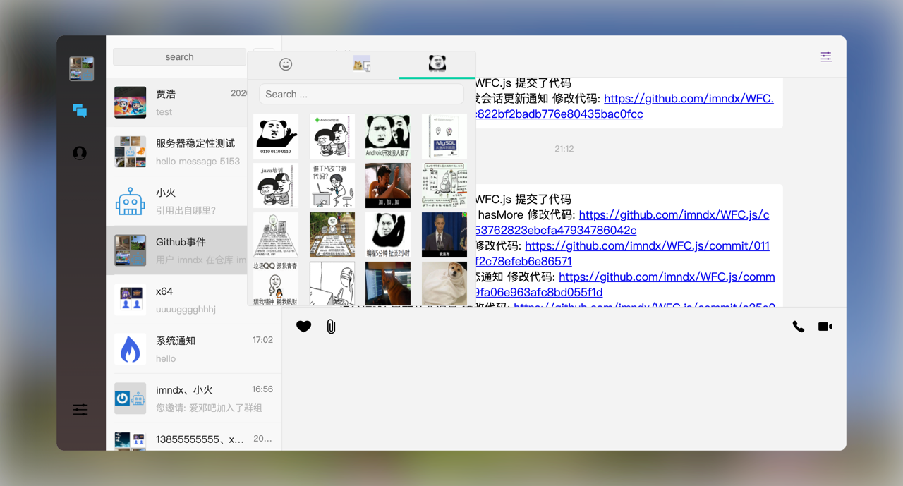

# vue-chat

野火IM VUE Demo，演示如何将野火IM的能力集成到VUE项目。


## 开发
1. ```npm install```
2. ```npm run serve```

## 截图








## License

1. Under the Creative Commons Attribution-NoDerivs 3.0 Unported license. See the [LICENSE](https://github.com/wildfirechat/vue-chat/blob/master/LICENSE) file for details.
2. Under the 996ICU License. See the [LICENSE](https://github.com/996icu/996.ICU/blob/master/LICENSE) file for details.

